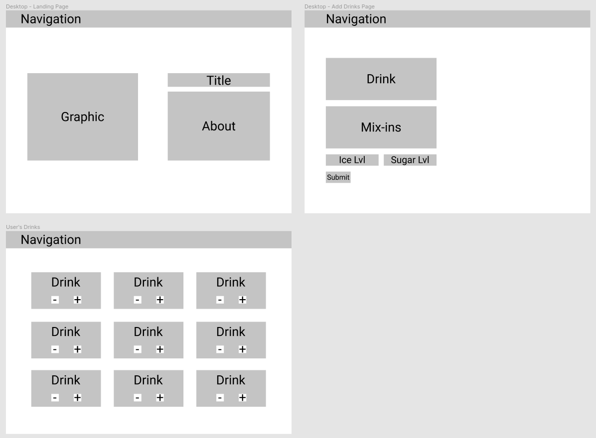

# 🍵 T(EA)racker: The Milk Tea Tracker
The T(EA)racker app is a full-stack application created using React, Node.js/Express and PostgreSQL.

Milk tea, otherwise known as boba tea, bubble milk tea or boba, is a tea-based drink primarily made of milk, tea, sugar and tapioca pearls. Since the rise in popularity of these drinks many different flavours and mixins (e.g. herbal jelly, custard etc.) have been used to make a variety of milk teas.

Using this app, a user can keep track of various milk tea orders using select drinks from popular milk tea chains including Chatime, Gong cha and ShareTea.

## 🛠️ Tools and Tech Used
- React
- SASS
- Node.js/Express
- PostgreSQL
- Heroku

## 🔍 How to use
- Create an account using the `Login|Signup` button.
- Start adding drinks by clicking the `Create Drinks` button.
- Change the drink counter based on how many drinks ordered.

## 🖥️ Try it out!
[The T(EA)racker App](https://pure-bastion-05745.herokuapp.com/)

## 🤔 Planning
To create basic wireframes, Figma was used.

## 🌟 Main Features
- Account creation and sign up.
- Account and sessions validation.
- Drink creation and ability to update and delete.
- Drink creation/update validation.
- Updating the amount of drinks ordered after the drink has been created.

## 💢 Difficulties Overcome
- Most of the difficulties with this project were from managing state using React. With managing different components and API calls, it was difficult.

## 👀 Features to Add
 - The option to type in a drink if the user's desired drink is not part of the given options.
 - A map to show nearest milk tea stores based on location.
 - Responsive CSS.

## 🙌 Acknowledgements
Special thanks to the instructional team at General Assembly for providing the resources and knowledge to learn full-stack software engineering! I would also like to thank Lindsay Cayas [@Okayasart](https://instagram.com/okayasart) for providing the art seen on this app.
